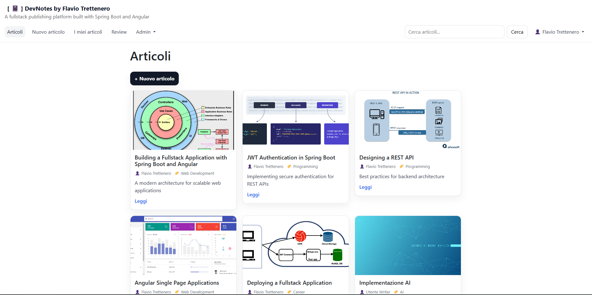
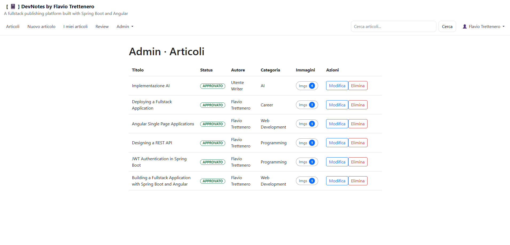
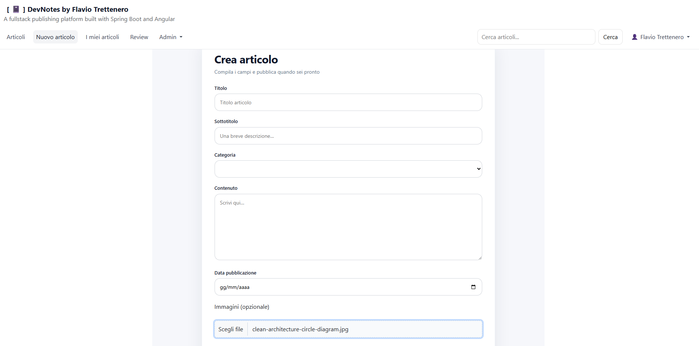
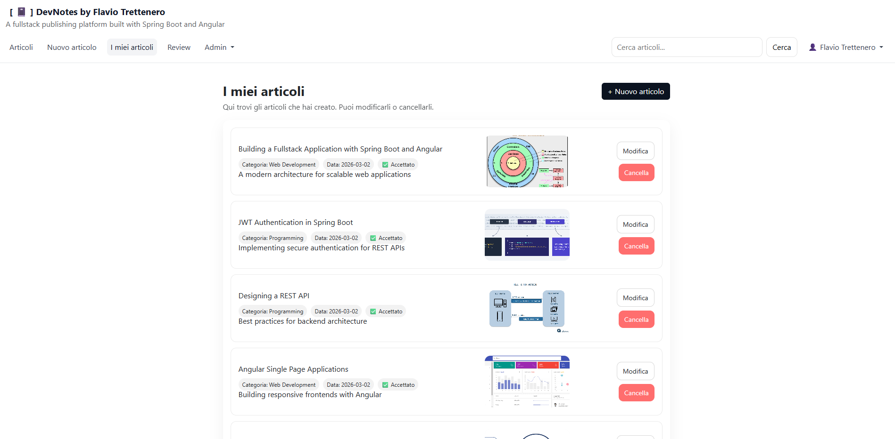
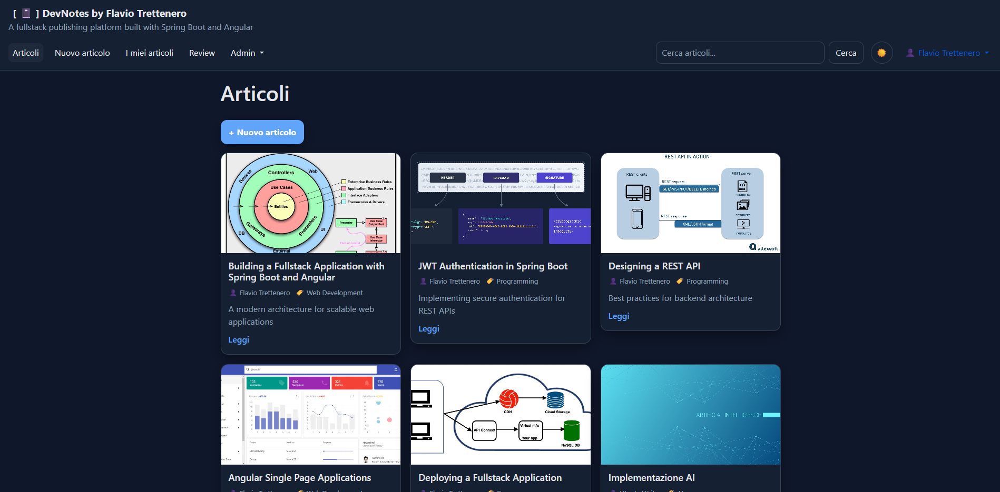
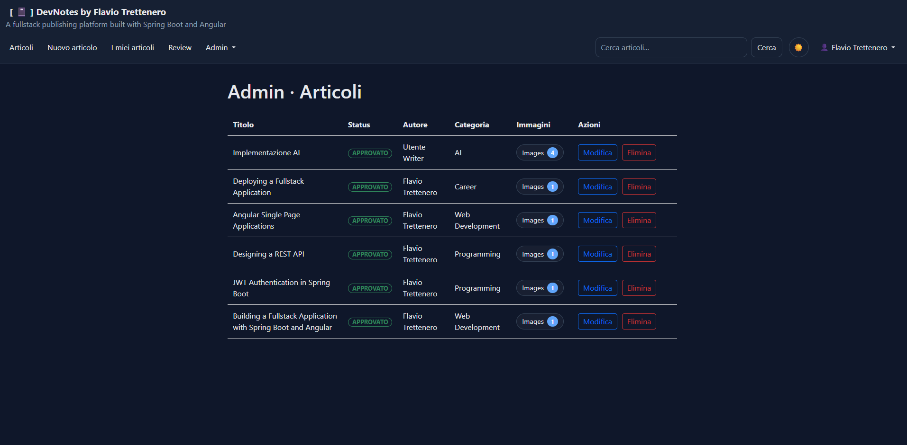
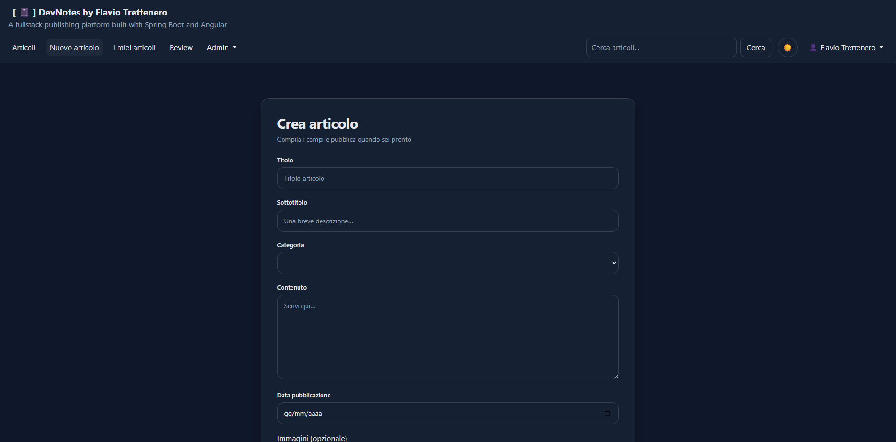
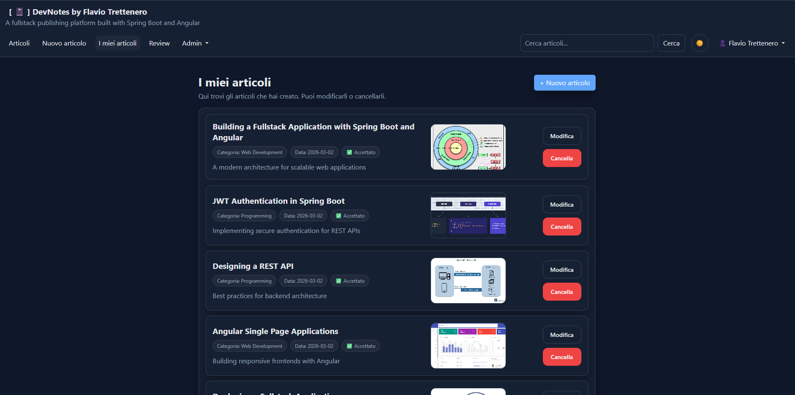
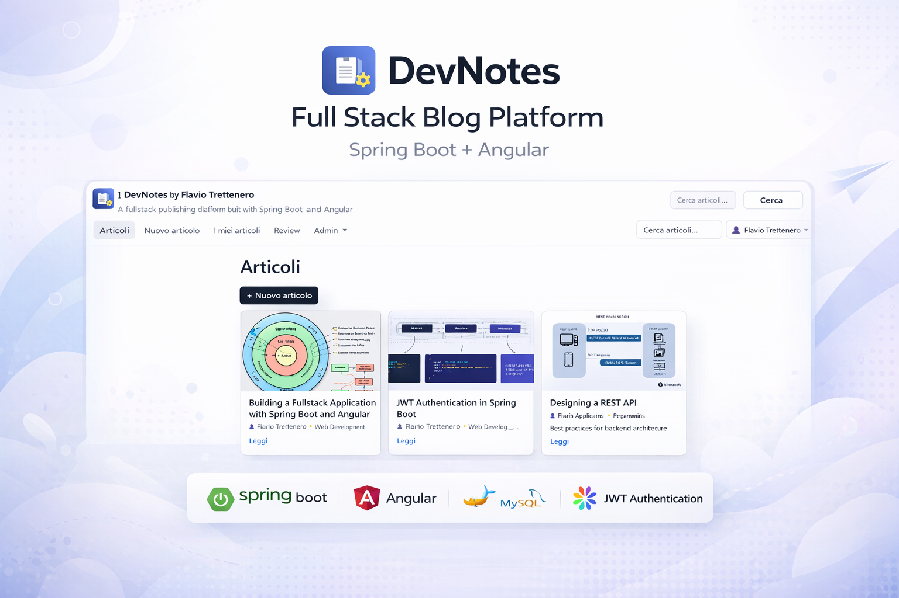
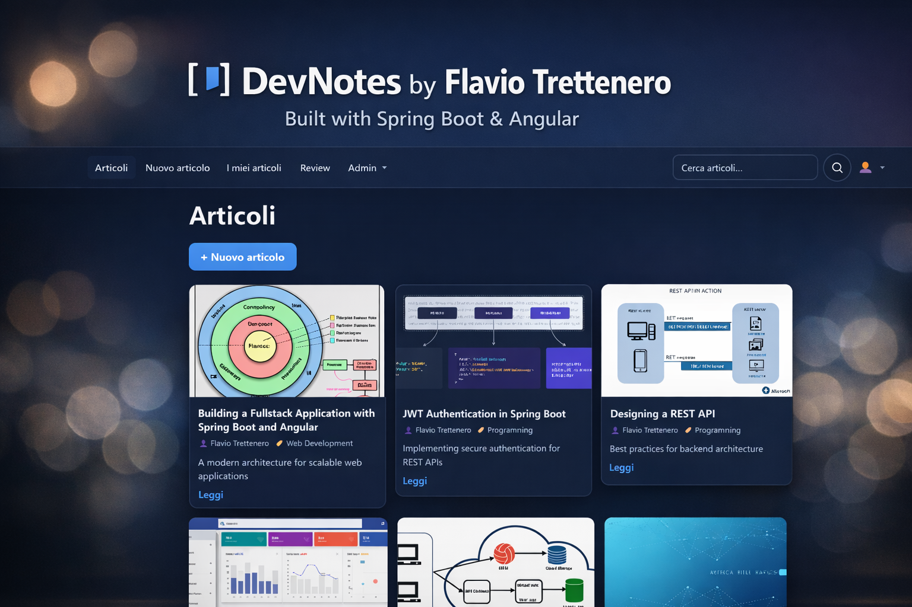

# 🚀 DevNotes


A role-based publishing platform built with **Spring Boot** and **Angular**, implementing secure authentication, article workflow and object storage.

---

## 🧠 Overview

DevNotes is a full stack publishing platform that allows users to create, review and manage technical articles.

---

## 📸 Screenshots

### 🌞 Light Mode

<p align="center">
  
  
</p>

<p align="center">
  
  
</p>

---

### 🌙 Dark Mode

<p align="center">
  
  
</p>

<p align="center">
  
  
</p>

---

### 🖼️ Cover

<p align="center">
  
  
</p>

---

## 🧩 Tech Stack

- Java 21  
- Spring Boot  
- Spring Security + JWT  
- Angular  
- MySQL  
- Docker + MinIO  

---

## 🏗️ Architecture

- Backend: Spring Boot REST API  
- Security: JWT Authentication  
- Frontend: Angular SPA  
- Database: MySQL  
- Storage: MinIO (S3-compatible)  
- Containerization: Docker Compose  

---

## 🔐 Authentication & Authorization

- JWT-based authentication  
- Role-based access control  

### Roles:
- Admin  
- Writer  
- Revisor  
- User  

---

## ✨ Main Features

- Article creation and editing  
- Article review workflow  
- Role management  
- Image upload  
- Category management  
- Admin dashboard  
- Secure REST API  

---

## 📁 Project Structure

```text
devnotes-api    -> Spring Boot backend
devnotes-web    -> Angular frontend
screenshots     -> README images
```

---

## ▶️ Running the Project

### Backend

```bash
cd devnotes-api
mvn spring-boot:run
```

### Frontend

```bash
cd devnotes-web
npm install
ng serve
```

---

## 🎯 Learning Focus

This project focuses on:

- Secure REST API design  
- Clean architecture principles  
- Role-based authorization  
- DTO mapping  
- Separation of concerns  
- State management in SPA  

---

## 👤 Author

**Flavio Trettenero**  
Full-Stack Developer  
Java • Spring Boot • Angular  

---

## 📄 License

MIT License
